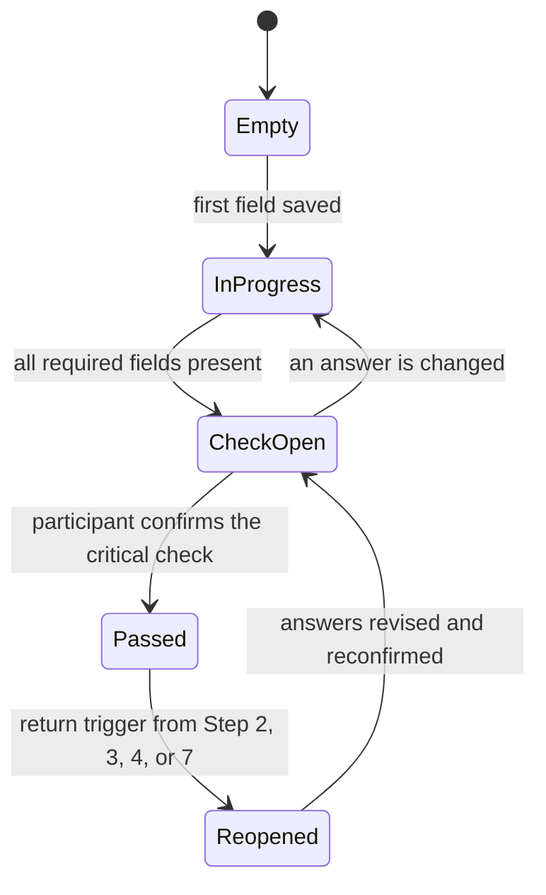

# Step 1, functional specification

Fields, checks, states, and what leaves the step. Nothing here describes how the
screen looks: the shape of the screen is in `design/platform-phase-a.md`.

**Every field key below is settled**, as are those in Steps 2 and 3. The six
decisions of 1 October 2026 were the last that could change them; see
`core/decisions.md`.

## The screen

Eight exercises in the order of the workbook: Exercises 1 to 5 on the first
working page, Exercises 6 to 8 on the second, each with its instruction page
before it. An exercise appears once the exercise above it has content, and
everything already written stays open for editing, so disclosure is about not
showing an empty wall rather than about locking anything. Only the critical check
is a separate moment. The participant works through the exercises in order and is
not sent ahead to come back. Page 8 points to no exercise beyond Exercises 1 to 5. The
check that decides whether the first attempt is rewritten or copied across is
printed on page 10, facing Exercise 6, where the problem definition is reconfirmed
and neatened, and the screen shows the check at Exercise 6.

The situation box collapses to a single line once the first attempt at the problem
definition exists. It has done its work by then, and leaving it open invites
participants to treat it as the answer.

## The two problem definitions

The problem definition is written twice. **Exercise 2 is the first attempt**, in
five slots in the default form, too much or too little. **Exercise 6 is the agreed
definition**, in any of the four forms, in five slots of its own. The agreed
definition is always written: rewritten where the eight rules on page 8 and the
check on page 10 find a cause, a blame, or a solution, and copied across from the
first attempt as it stands where they find none. The first attempt is kept rather than
crossed out, so that both are visible. On screen the first attempt is shown beside
the agreed slots with a button that copies its five slots across, the direction
as its words. Nothing is copied until the participant asks, the button is offered
only once all five slots of the first attempt are written, and anything already in
the agreed slots is replaced only after the participant agrees.

**Every later step reads the `agreed_*` set. The `problem_*` set is the first
attempt and is read by nothing downstream.** No step after Step 1, no page 25
zone, and no return trigger takes a value from `problem_thing`,
`problem_direction`, `problem_who`, `problem_since`, or `problem_consequence`.
Wiring the first attempt to a later step is a fault, however convenient the slot.

In particular:

- Step 3's `thing_measured` copies `agreed_thing`, not `problem_thing`.
- Page 25, zone 1, carries the assembled agreed definition.
- Every reference in Steps 2 and 3 to the quantity or the thing the problem
  definition names means the agreed one, and since 2 October 2026 the pages say
  so: page 12 reads "the quantity named in the agreed problem definition", page 21
  "The thing measured, from the agreed problem definition", and pages 20 and 23
  likewise name the agreed problem definition.
- Renaming the thing means editing `agreed_thing`, which marks Step 3 for review
  through the ordinary dependency machinery. That is what the two Step 3 returns
  to page 11 rely on.

## Fields

| Exercise | Key | Input | Required | What the system checks |
| --- | --- | --- | --- | --- |
| 1. The situation | `situation` | Free text, two printed lines | Yes | Non-empty |
| 2. The problem definition, first attempt | `problem_thing`, `problem_direction`, `problem_who`, `problem_since`, `problem_consequence` | Five slots, in the default form only: too much or too little of a thing, for whom, since when, which matters because. `problem_direction` is too much or too little | All five | Each slot non-empty. The assembled first attempt is shown back in full, so the participant reads what they have actually written. **Read by nothing downstream** |
| 2. Rationale | `rationale` | Free text, three lines | Yes | Non-empty. Written once, against the first attempt, and not repeated with the agreed definition |
| 3. Suitability | `suit_chronic`, `suit_history`, `suit_attempts`, `suit_size` | Four yes or no | All four answered | A "no" to any of the four raises a warning that asks for one line before it can be dismissed. It warns, it never blocks: a participant may have a good reason. A "no" on the size question sends the participant to narrow or widen the problem definition, as page 10 explains ("If the problem is too large, or too small"), which is a return to Exercise 2, and to Exercise 6 once it has been written: the warning never links ahead to an exercise not yet reached. A "no" on any of the other three asks whether this is the kind of problem the process is for |
| 3. Suitability | `suit_chronic_note`, `suit_history_note`, `suit_attempts_note`, `suit_size_note` | One line each, printed "How you know" | No | None. The check is on the answer |
| 3. The disqualifier | `suit_procedure_would_solve` | Yes or no to "Could a known procedure solve this, if someone chose to?", a field of its own and not a fifth suitability question | Yes | **A yes is a stop, not a warning.** The page prints "Choose a different topic", and the screen shows that explanation and does not let the critical check open while the answer is yes. The stop cannot be dismissed. Its return address is Exercise 1: a different topic. Nothing written is erased. The tool is acting on the participant's own answer, not judging its quality, so principle 14 is not in the way |
| 3. The disqualifier | `suit_procedure_note` | One line, printed "How you know" | No | None. The check is on the answer |
| 4. The desired change | `change_long`, `change_long_year`, `change_near`, `change_near_year` | Two boxes, each with a year | The long horizon and its year are required, the nearer one and its year optional | Flags instrument words (ban, subsidy, campaign, platform, app, training) as a warning that names the word found: "The desired change names 'subsidy', which is a potential solution: say what would be different, not how to get there.", with the word the tool found in place of 'subsidy'. The tool also catches other forms, such as "subsidies" and "trained", and names the word as listed. The warning offers a button, "Keep a copy with the potential solutions, for later", which copies the whole desired change, as written, to the parked list and then shows "Kept with the potential solutions, for later." where the button was. The desired change itself is left as written: the tool never edits the participant's answer, and adds to the parked list only when asked. Never blocks. The year is the horizon Step 3 draws the desired change against |
| 5. Position | `position`, `on_behalf_of` | One of five, none pre-selected, "analysing from outside" printed first | Yes | Anything other than analysing from outside requires `on_behalf_of` |
| 6. The problem form | `problem_form` | One of four, in fixed order: excess or deficit, mismatch, falling short of a standard, not yet happened. Ticked first, because the form governs what the slots below it mean | Yes. None is pre-selected: the default form is printed first, and the participant ticks it | If it is not the first, `form_reason` must be non-empty |
| 6. The problem form | `form_reason` | One line, printed "If not the default form, why it did not fit" | Where the form is not the first | Non-empty when required |
| 6. The problem definition, agreed | `agreed_thing`, `agreed_direction`, `agreed_who`, `agreed_since`, `agreed_consequence` | Five slots, printed "the thing", "what is wrong with it", "who it affects", "since when", and "which matters because". The labels are more neutral than the first attempt's because the agreed definition may be written in any of the four forms. `agreed_direction` is free text for the same reason | All five | Each slot non-empty. The assembled agreed definition is shown back in full, beside the first attempt. **This is the problem definition every later step reads** |
| 7. How others describe it | `rep_description`, `rep_source`, `rep_assumption`, `rep_omission` | One description, in four fields: the description in its authors' words, where it was read, what it takes for granted, and what it leaves out, printed "What that description leaves out". One description, not a list: page 10 prints "One description is enough here; the others come later." (decided 2 October 2026) | `rep_description`, `rep_source`, and `rep_assumption`. `rep_omission` is optional | `rep_source` non-empty. No judgement of the content |
| 8. Potential solutions, for later | `parked[]` | A list, added to from any step | No | None. Shown in Step 1 as Exercise 8, which the fifth criterion asks about. On every other step before Step 7, only its count shows. It is opened again in Step 7 |
| Foot of every working page | `revised_on`, `revised_because` | Date and free text, printed "Revised on ... because" at the foot of pages 9 and 11 | No | Recorded, never erased. On screen both are written from the revision log and never typed separately: they hold the date and the reason of the step's latest revision, and every earlier revision stays in the log. See "The revision log" below |

The checks in the last column are mechanical: a field is empty, a value is set,
a word appears. Nothing in Step 1 scores the quality of a problem definition,
and nothing should be built that pretends to.

## States

Passed is never removed by the system. A return trigger marks the step as
reopened and shows what raised it, and the participant decides whether anything
changes. Reconfirming without editing is an allowed answer, recorded with the
date, because "I looked and it still holds" is a finding.

## The revision log

Decided 2 October 2026: on screen the record of a revision is the revision log,
and the strip at the foot of each working page is written from the log. The log
is kept for the whole case, and each entry belongs to one step. Steps 2 and 3 use
the same log. Nothing in the log is erased.

A revision is two acts. Editing an answer in a step that has passed opens a
pending revision and shows the step as reopened. The participant then writes the
reason in the strip and records the revision, which writes an entry to the log
and marks the steps that use this one for review; reconfirming the critical check
returns the step to passed.

| Key | What it holds |
| --- | --- |
| `revisions[].step` | The step the entry belongs to |
| `revisions[].at` | The date and time of the entry |
| `revisions[].kind` | One of three: `revision`, a change recorded with its reason; `reconfirmed`, the critical check confirmed again after a revision or a return; `review`, a review mark resolved |
| `revisions[].because` | For a revision, the reason written in the strip, which is required. For a reconfirmation or a review, the one line the participant may add |
| `revisions[].since` | For a revision, when the first edit after the pass was made |
| `revisions[].fields[]` | For a revision, every field that changed, each as `key`, `before`, and `after`, so that a review mark can show what changed |
| `revisions[].returns` | For a reconfirmation, the returns it resolved |
| `revisions[].mark` | For a review, the review mark it resolved |
| `revisions[].review_result` | For a review, `unchanged` ("I looked, and it still holds") or `revised` |

Recording a revision also writes a review mark on each step it marks: the step
marked (`marks[].on`), the step revised (`marks[].from`), the date and time
(`marks[].at`), the revision (`marks[].revision`), the keys of the fields that
changed (`marks[].fields`), and the reason (`marks[].because`). A mark is
resolved (`marks[].resolved`, with its date, whether the step was revised or left
unchanged as `review_result`, and an optional line), never deleted. Every entry
and every mark also carries an `id`.

`revised_on` holds the date of the step's latest entry of kind `revision`, and
`revised_because` holds that entry's reason. Neither is typed separately, and an
earlier revision is never overwritten, because the log keeps it. An export, once
one is built, prints each strip from the log.

## The critical check

The system opens the critical check when the required fields are present and the
disqualifier is not answered yes. The criteria are self-checked, each ticked by the
participant and stored with a timestamp. The wording below is the workbook's, page
24, which is the participant-facing version; the step description carries the same
five word for word, settled on 1 October 2026. The criteria name the agreed
problem definition, `agreed_*` in Exercise 6, and never the first attempt: the
first attempt is kept so that both are visible, and almost every first attempt
carries a cause, a blame, or a solution, so the first attempt is not what the check reads.

Each criterion names where it sends the participant when it cannot be ticked
(decided 2 October 2026). The returns are the prototype's, converted to the pages
the exercises are printed on: page 24 prints the page beside each criterion,
generated from the page order, and the screen names the exercise and its page.

| Criterion | If it cannot be ticked, back to |
| --- | --- |
| The agreed problem definition states a situation, not a solution: what is wrong with something valued, with the reason it matters and for whom. | Exercise 6, page 11 |
| Your position is named. | Exercise 5, page 9 |
| The desired change is stated after the problem, not before it, in the same terms as the agreed problem definition. | Exercise 4, page 9 |
| The four questions in Exercise 3 are answered, and a known procedure would not solve the problem. | Exercise 3, page 9 |
| Potential solutions that occurred to you are in Exercise 8, not in the agreed problem definition. | Exercise 8, page 11 |

A participant can pass the critical check with a weak answer. That is intended:
the critical check makes the criteria visible and the claim explicit, and Step 3
will expose a problem definition that cannot be traced over time. What the
critical check prevents is moving on with the fields blank.

## What carries forward

| Output | Goes to | Used as |
| --- | --- | --- |
| The agreed problem definition, `agreed_*` | Steps 2, 3, 4 | The subject of the boundary, the quantity graphed over time, and the first named variable |
| The excess or deficit itself, as agreed | Steps 4, 5, 10 | The first candidate stock |
| Rationale | Steps 8, 12 | Who is affected and against what standard, which is what the consequences step works from |
| Desired change, with its years | Steps 3, 9, 11 | What "better" means on the graph and by when, and the outcome the theory of change has to reach |
| Representation and its assumption | Steps 2, 7 | Whose framing sets the first actor list, and where invisible power is looked for |
| Position | Steps 7, 12, 13 | Whether own influence is mapped, what Step 12 delivers (an ask, options, a decision, findings), and who Step 13 addresses |
| Parked ideas | Step 7 | The list opened when interventions are finally discussed |

The first attempt, `problem_*`, carries nowhere. Revising Step 1 marks every step
the table above sends an output to, which is every later step except Step 6:
Steps 2, 3, 4, 5, 7, 8, 9, 10, 11, 12, and 13 (decided 2 October 2026). Within
Phase A that is Steps 2 and 3; the others are marked once they are built.

## What comes back into Step 1

| Trigger | Raised at | What is reopened |
| --- | --- | --- |
| The pattern over time cannot be drawn for the thing named | Step 3 | `agreed_thing` and `agreed_direction`, on page 11, usually because the thing is not a quantity |
| The line can be drawn, but it is not the problem | Step 3 | `agreed_thing`, on page 11: the problem definition named a proxy |
| Fewer than about six, or more than about twenty, variables survive naming | Step 4 | `suit_size` and `suit_size_note` |
| The actors who matter all sit outside the boundary | Step 2 | `agreed_thing`, `agreed_who`, and `change_long` |
| The powerful actors' description turns out to be different from the one recorded | Step 7 | The representation fields only: `rep_description`, `rep_source`, `rep_assumption`, and `rep_omission` |

Each trigger reopens the fields it names, not the whole step.

## What is deliberately not built

No scoring or grading of the problem definition. No library of ready-made problems
to choose from, which would remove the step. No facilitator or lecturer approval
anywhere in the flow. No lock on an earlier step once a later one has been
started.
